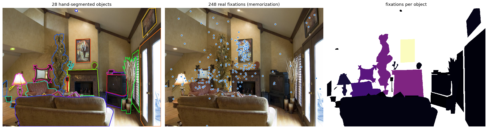
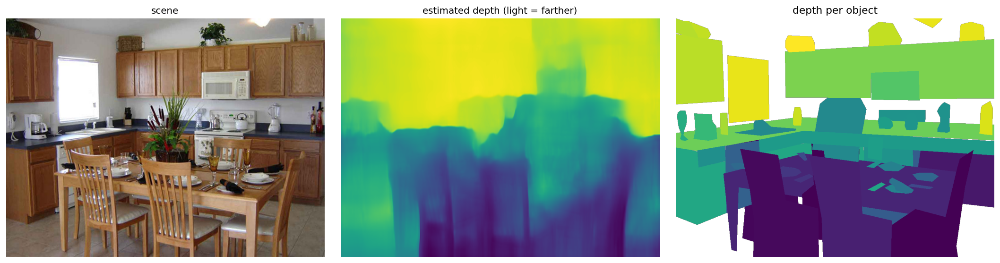

# Objects in Focus

**What was this person looking at?**

Eye-trackers answer *where* someone looked — an x, y coordinate. Research on
attention usually needs the other answer: *what* they looked at. Objects in
Focus is a dataset and a small Python package for getting from one to the
other in cluttered, real-world scenes.

<p align="center">
  
</p>

100 photographs, every object in them hand-segmented — not just the
foreground, and not only categories from a fixed list. 2,427 objects, 359
distinct labels, with depth maps, the real fixations recorded while people
memorized each scene (`raw/`), and the tools to map one onto the other.

[](https://colab.research.google.com/github/ehhall/objects-in-focus/blob/main/notebooks/objects_in_focus_tutorial.ipynb)
[](https://ehhall.github.io/objects-in-focus/)
[](LICENSE)
[](LICENSE-DATA)

---

## Start here (no installation)

The [**Colab tutorial**](https://colab.research.google.com/github/ehhall/objects-in-focus/blob/main/notebooks/objects_in_focus_tutorial.ipynb)
runs in your browser. It installs the package, downloads the data, and walks
through mapping fixations to objects with pictures at every step. If you have
never used Python before, start there — press the play buttons in order.

## Start here (on your own machine)

```bash
git clone https://github.com/ehhall/objects-in-focus.git
cd objects-in-focus
pip install -e ".[full]"
```

Then check that your copy of the data is complete:

```bash
oif check
```

That is the whole setup. Every command below assumes you are in that folder.

## The five-line version

```python
from oif import OiF

data = OiF()                       # finds the data folder you are standing in
scene = data["target_kitchen_IDS01"]

fixations = data.fixations()                     # everything in raw/
looked_at = scene.map_fixations(fixations, method="disc", radius=25)
looked_at[["x", "y", "task", "label"]].head()
```

```
       x      y      task      label
0  934.0    8.0  memorize  container
1  936.0   52.0  memorize  container
2   77.0   82.0  memorize    cabinet
3  753.0   92.0  memorize    cabinet
4  600.0  122.0  memorize    cabinet
```

Those are real fixations — the dataset ships the eye movements recorded while
viewers memorized each scene, one binary map per scene in `raw/`.

One row per fixation, with the object it landed on. That is the thing this
package exists to give you.

### One row per object instead

```python
table = scene.object_table(fixations)
```

| label | size | ecc | depth | n_fixations |
|---|---|---|---|---|
| chair | 16,389 | 75.2 | 0.34 | 44 |
| plant | 16,470 | 73.1 | 0.73 | 26 |
| stove | 10,263 | 200.3 | 0.57 | 21 |
| table | 49,517 | 182.9 | 0.23 | 18 |

`size` is the object's visible pixels, `ecc` how far it sits from the centre
of the picture, `depth` how far away it is. Those, plus salience, are what the
attention model predicts fixations from.

### A picture of it

```python
import matplotlib.pyplot as plt
from oif.viz import show_objects, show_object_values

show_objects(scene.image, scene.label_map, labels=scene.labels)
show_object_values(scene.label_map,
                   dict(zip(table.mask_id, table.n_fixations)),
                   label="fixations")
plt.show()
```

---

## What is in the box

| Folder | Contents |
|---|---|
| `images/` | 100 scenes, 1024 × 768 PNG. Fifty indoor, fifty outdoor. |
| `annotations/` | CVAT 1.1 polygon exports — one `<polygon>` per annotated object. |
| `masks/` | Integer label maps, 768 × 1024. `mask[y, x]` is the id of the object at that pixel. |
| `depth/` | MonoDepth2 disparity maps, one per scene. |
| `derived/` | Written by the package: `labels.csv` says what each mask id is. |
| `raw/` | The released fixations: one 768 × 1024 binary map per scene (`target_<scene>_memorize.npy`), a 1 at every pixel a fixation landed on, pooled over viewers. Your own fixation reports go here too. |
| `notebooks/` | The tutorial, plus the original analysis notebooks. |
| `papers/` | The paper and the ICCV 2025 poster. |

Full detail on every file, including the exact array conventions:
[`docs/dataset.md`](docs/dataset.md).

### Bringing your own fixations

The shipped `.npy` maps are pooled, so they carry no viewer identity, order
or durations. Your own data can carry all of it: drop your eye-tracker's CSV
exports into `raw/` (they sit happily next to the maps) and run:

```bash
oif fixations
```

It reads SR Research DataViewer exports (`CURRENT_FIX_X`, `CURRENT_FIX_Y`, …)
and the older `locs_1`/`locs_2`/`durs` layout without being told. For anything
else, name the columns once:

```python
from oif import load_fixations
fixations = load_fixations("raw/", columns={"x": "gaze_x", "y": "gaze_y",
                                            "image": "stimulus"})
```

Whatever goes in, what comes out is the same table: `subject, image,
fix_index, x, y, duration, task`.

---

## The command line

Every command takes `--root` if the data lives elsewhere.

```bash
oif check                    # is my copy of the data complete?
oif labels                   # write derived/labels.csv — what each mask id is
oif repair                   # rebuild mask files that were uploaded truncated
oif objects --fixations raw/ # one CSV, one row per object, features + counts
oif demo target_bakery --labels   # save a picture of one scene's objects
oif stats                    # headline dataset numbers
```

---

## How fixations get assigned to objects

Objects overlap. Gaze coordinates drift. So the assignment rule is a choice,
and the package makes you make it:

```python
scene.map_fixations(fixations, method="point")               # the pixel under the fixation
scene.map_fixations(fixations, method="disc", radius=25)     # majority within 25 px
scene.map_fixations(fixations, method="nearest", radius=25)  # nearest object if on background
```

`point` is exact and unforgiving. `disc` absorbs calibration error — a
fixation just off a small object still lands on it — and is usually what you
want with real data; 25 px is roughly one degree of visual angle at a typical
desktop viewing distance. `nearest` forces every fixation onto something.
Fixations that stay unassigned come back as `mask_id = 0`, label
`"background"`, never silently dropped.

Underneath, objects are painted into the label map **back to front**, using
the depth map, so the object that wins an overlap is the one nearest the
viewer — the thing they actually saw.

<p align="center">
  
</p>

---

## The attention model

The paper's model predicts how many fixations an object gets from four
numbers: how big it is, how far from the centre, how far away, and how
salient.

```python
from oif import add_model_terms, ObjectAttentionModel

table = add_model_terms(data.object_tables(fixations))
model = ObjectAttentionModel().fit(table)

model.coefficients
model.score(table)          # {'r2': ..., 'mae_log': ..., 'mae_count': ...}
table["predicted"] = model.predict(table, scale="count")
```

Published fits are in `oif.PUBLISHED_FIT` so you can see what you are up
against: R² = 0.82 on OiF, 0.66 on COCO-Freeview. To test generalisation
honestly, hold out whole scenes rather than random objects:

```python
from oif.model import cross_validate_by_scene
cross_validate_by_scene(table, n_folds=5)
```

Salience maps are not bundled — bring your own from
[DeepGaze](https://github.com/matthias-k/DeepGaze) (DeepGaze IIE produced the
published numbers; [DeepGaze III](https://doi.org/10.1167/jov.22.5.7) is the
current model) and load them with `oif.salience.load_salience_maps`. Without
them everything still runs, minus that one predictor.

## COCO-Freeview

The same analysis on MS-COCO scenes, for checking whether a result holds
beyond these 100 pictures:

```python
from oif import COCOFreeview

coco = COCOFreeview("path/to/coco-freeview")
table = coco.object_tables(fixations)
```

It handles the two things that make COCO different: one category id covers
every instance (split into instances automatically), and images were shown
letterboxed on a 1680 × 1050 display (reproduced, so fixations and
segmentations line up). See [`docs/coco.md`](docs/coco.md).

---

## Notes on the published data

Working through the release turned up three things, all handled by the
package rather than left as traps:

1. **Nine mask files were uploaded truncated** (2 bytes each): campsite,
   canal, canyon, casino, castle, cemetery, church, city, classroom. `oif
   repair` rebuilds them from the annotations and depth maps and records what
   it painted into each id. Loading one of these scenes works either way — the
   label map is rebuilt in memory if the file is unreadable.
2. **The mask ids had no label lookup.** Ids in `masks/` were anonymous
   integers with nothing saying which was the sofa. `oif labels` recovers the
   mapping by peeling the painting order back off the label map, and reports a
   match score per object; all 2,427 objects come back above 0.99. See
   [`docs/labels.md`](docs/labels.md) for how it works and why it is
   trustworthy.
3. **Two scenes are spelled differently across folders**
   (`target_AtticStorage` vs `target_atticstorage`). All file lookups are
   case-insensitive, so this is invisible unless you build paths by hand.

---

## Documentation

- [`docs/quickstart.md`](docs/quickstart.md) — the ten-minute version
- [`docs/dataset.md`](docs/dataset.md) — every file, every array convention
- [`docs/labels.md`](docs/labels.md) — how mask ids were matched back to objects
- [`docs/api.md`](docs/api.md) — the functions, grouped by what they are for
- [`docs/coco.md`](docs/coco.md) — the COCO-Freeview adapter
- [`docs/contributing.md`](docs/contributing.md) — how to help

## Papers

The segmentation process and the attention model:

- Hall, E. H., & Loh, Z. **Objects in Focus: Predicting Object-Based Attention
  from Spatial Features.** ICCV 2025 Workshop on Human-Inspired Computer
  Vision. [`papers/HiCV_2025_Final.pdf`](papers/HiCV_2025_Final.pdf)
- **Objects in Focus.** PsyArXiv preprint.
  https://osf.io/preprints/psyarxiv/k8b9s

Work built on these segmentations:

- Hayes, T. R., & Henderson, J. M. (2021). Looking for semantic similarity.
  *Psychological Science.* https://osf.io/wsyz9
- Peacock, C. E., Hall, E. H., & Henderson, J. M. (2023). Objects are selected
  for attention based upon meaning during passive scene viewing.
  *Psychonomic Bulletin & Review.*
  https://link.springer.com/article/10.3758/s13423-023-02286-2
- Hall, E. H., & Henderson, J. M. (2021). Surface-based attention and visual
  search. *Journal of Vision.*
  https://jov.arvojournals.org/article.aspx?articleid=2777949

If you use the data or the code, please cite the paper — see
[`CITATION.cff`](CITATION.cff).

## Licence

Code MIT ([`LICENSE`](LICENSE)). Data CC BY 4.0
([`LICENSE-DATA`](LICENSE-DATA)) — use it, change it, build on it, just say
where it came from.

## Getting help

Open an [issue](https://github.com/ehhall/objects-in-focus/issues) with what
you ran and what happened. Questions about the data itself are welcome too —
they usually mean the documentation has a hole in it.
